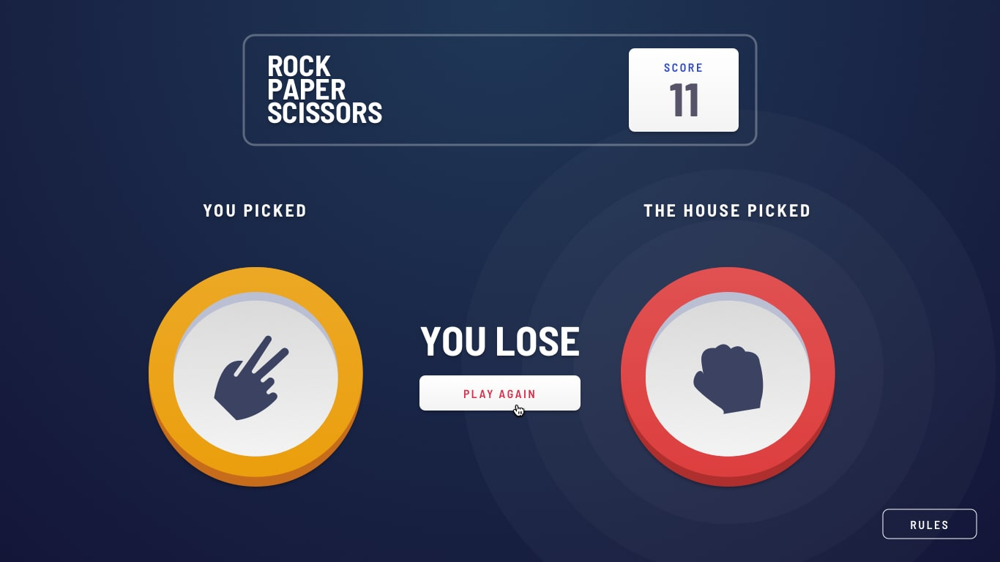

# Frontend Mentor - Rock, Paper, Scissors solution

This is a solution to the [Rock, Paper, Scissors challenge on Frontend Mentor](https://www.frontendmentor.io/challenges/rock-paper-scissors-game-pTgwgvgH). Frontend Mentor challenges help you improve your coding skills by building realistic projects. 

## Table of contents

- [Overview](#overview)
  - [The challenge](#the-challenge)
  - [Screenshot](#screenshot)
  - [Links](#links)
- [My process](#my-process)
  - [Built with](#built-with)
  - [What I learned](#what-i-learned)
  - [Continued development](#continued-development)
  - [Useful resources](#useful-resources)
- [Author](#author)
- [Acknowledgments](#acknowledgments)


## Overview

### The challenge

Users should be able to:

- View the optimal layout for the game depending on their device's screen size
- Play Rock, Paper, Scissors against the computer
- Maintain the state of the score after refreshing the browser
- Display warning on refreshing the page

### Screenshot





### Links

- Solution URL: [Add solution URL here](https://github.com/zohaibxJackie/Rock-Paper-Scissors-Game)
- Live Site URL: [Add live site URL here](https://your-live-site-url.com)

## My process

### Built with

- Html 5
- Tailwind
- Desktop-first workflow
- [React](https://reactjs.org/) - JS library

### What I learned

This was an amazing challenge. I learned a lot from it. First time I use Context API in react😁. Of course, I learned it from Youtube. The issue I was facing was with score. I did not know how to update the score in header, I spent many hours on that problem and it turned out to be so easy😒. 

One important thing that leaned was that do not use chat gpt for react. The reason is that it give you response of the old version of React while react is updated. So be careful when using chat gpt for react.

The last thing I learned is Tailwind css. While have a strong grip on css but I have never used Tailwind css, so this was the first time I used Tailwind css. It is better to use and learn rather than watching different tutorials🤮.

To see how you can add Context API, see below:

- Create a separate file for the with name context, this where all of the context will be saved.
- Inside make another file for the context but with the name for which you are creating the context like in my case it is score
- Now you will have to create two more files, one with the name ScoreContext and the other with the name ScoreState(The name score is only example, it can be anything you want).
- Following code will be stored in ScoreContext:
```js
import { createContext } from "react";

const ScoreContext = createContext();

export default ScoreContext;
```

- Following code will be stored in ScoreState

```js
import React, { useState } from 'react';
import ScoreContext from './ScoreContext';

const ScoreState = (props) => {
    const [score, setScore] = useState(0);
    const updateScore = () => {
        console.log("function updateScore is called");
        setScore(prevScore => score + 1);
    }
  return (
    <ScoreContext.Provider value={{score, updateScore}}>
        {props.children}
    </ScoreContext.Provider>
  )
}

export default ScoreState;
```
- Let me explain
```txt
1- First we created a context in ScoreContext file.
2- Then we imported it in ScoreState.
3-You may think why we made so many files🤔
4- It is usually a good practice to have different files so that we can modify it in future or may be someone else want to make changes in future.
5- Now we will write the name of the file that we imported in a tag like <ScoreContext.Provider> and will have to give it a value which depends on the developer.
6- Basically, I have made a variable named score and a function named updateScore. The score variable contains the value of score, 0 by default and whenever the function is called the value of score will be incremented.
7- In the value, we are exporting the variable and function. Now, every child can use it where we want to import it.
8- My solution was to import the score variable in header component as it contains the score area and the function will be called in phase_2 component. So whenver the user wins, this function will be called.
9- To use the variables globally, we have to import it in app.js file, and then wrap the whole app in <ScoreState></ScoreState>. Of course, first we need to import it.
10- Now, let's say I want to use it header.jsx file. I would have to import ScoreContext file and then by destructuring method, extract the score variable but also passing the ScoreContext in a function named useContext. Follwing is the demonstration:
```

```js
import { useContext } from 'react'
import ScoreContext from '../context/score/ScoreContext'
// Rest of the code
const Header = () => {
    const {score} = useContext(ScoreContext);
    // Rest of the code
}
```


### Continued development

Although, I have learned a lot from this project but there are still many areas where I need improvements especially using the context api and passing props. I will try to implement these things in my future prjects.

### Useful resources

- [CodeWithHarry](https://youtu.be/3u9GZQN7ZUQ?si=5v671MCJUnvIQY6L) - This helped me with Context API. I really liked this video.


## Author

- Website - [Muhammad Zohaib](https://muhammadzohaib4.wordpress.com/)
- Frontend Mentor - [@zohaibxJackie](https://www.frontendmentor.io/profile/zohaibxJackie)
- Linkedin - [@MuhammadZohaib](www.linkedin.com/in/muhammad-zohaib-a42923316)
- Instagram - [@muhammadzohaibofficial1](https://www.instagram.com/muhammadzohaibofficial1?igsh=bHQwN3FoMm5idXd2)

## Acknowledgments

I would like to thank [@FrontendMentor](https://www.frontendmentor.io/) for giving me this opportunity to improve myself, and also for sharing these resources for free. Your guidence have been greatly appreciated.
